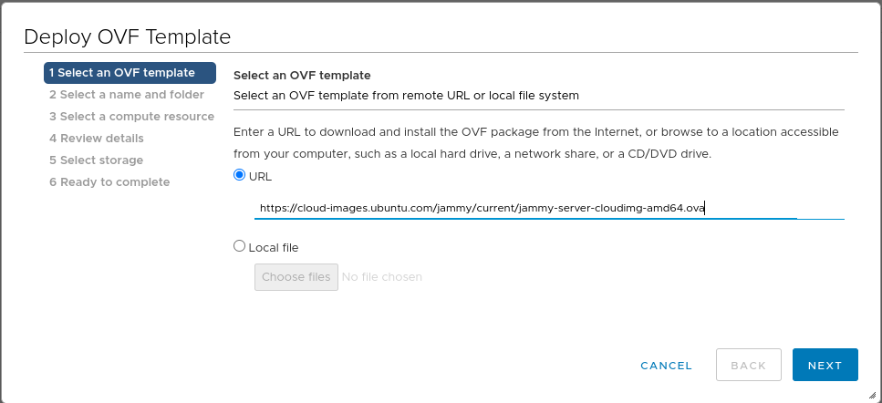
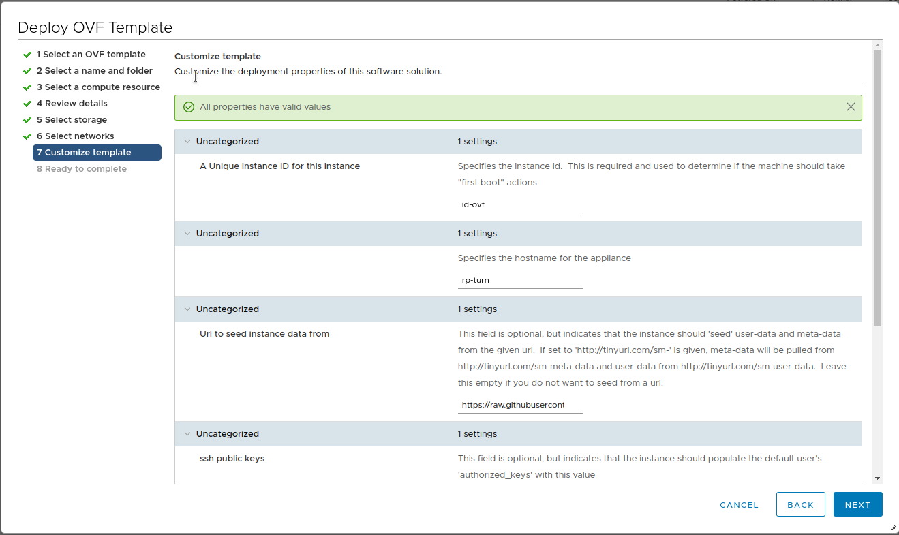

# VMware vSphere

These instructions are for an ESXi host managed by vCenter and are not applicable for stand alone ESXi hosts.

Pre-generated OVA images are available for download at [https://dl.pexip.com/rpturn/](https://dl.pexip.com/rpturn/), these instructions are for manually building a VM image using this repo.

### 1. Select a base image
For this example we'll use the Ubuntu 22.04 (Jammy) cloud OVA as our base.
The latest image can be found here: https://cloud-images.ubuntu.com/jammy/current/jammy-server-cloudimg-amd64.ova

Other Ubuntu cloud images are available for browsing here: https://cloud-images.ubuntu.com/

### 2. Deploy cloud OVA image
Inside vCenter, right click on the folder, resource pool or host you want to use to build this VM on the tree view in the left pane and select "Deploy OVF Template..."
Paste the URL to the OVA base image we selected earlier and click next.

In the next steps, choose a VM name, folder, compute resource, storage and network.

At "Customize template", choose a VM hostname and set the instance seed data URL to `https://raw.githubusercontent.com/pexip/rp-turn/master/cloud-init/installer/`.
Optionally you may also set SSH public keys here.

Confirm and click finish.

### 3. Boot image for provisioning
Wait for the OVA deploy task to finish (as indicated by the progress bar at the bottom of the page) and boot the VM.
The VM will power up, provision itself and power off again automatically once complete.
This process should take about 10 minutes but may take longer if using a slow internet connection.

### 4. Completion
You may now clone or export the VM if you need to deploy multiple RP Turn instances.
If you only require a single instance, power the built VM back up.
On first login it will prompt for a password change and start the install wizard.
